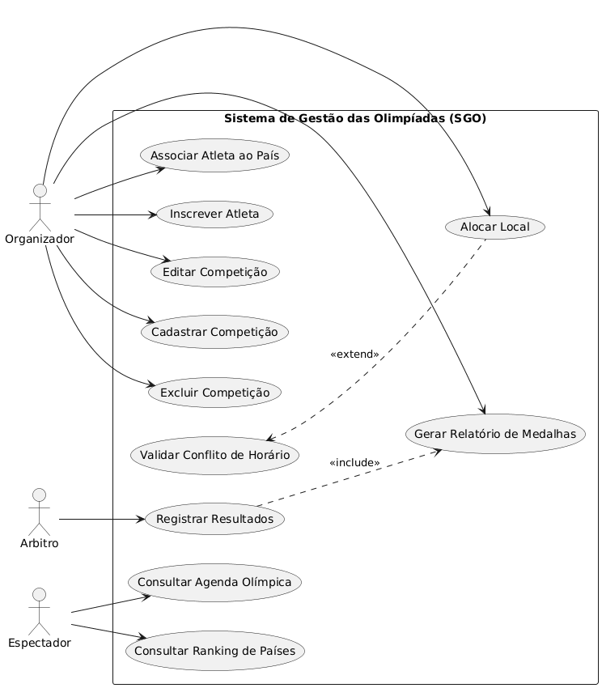
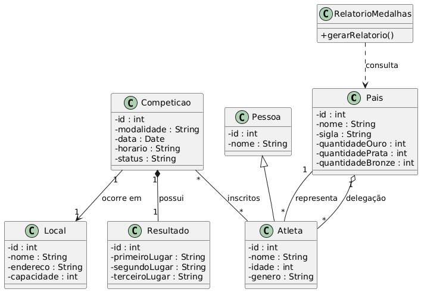
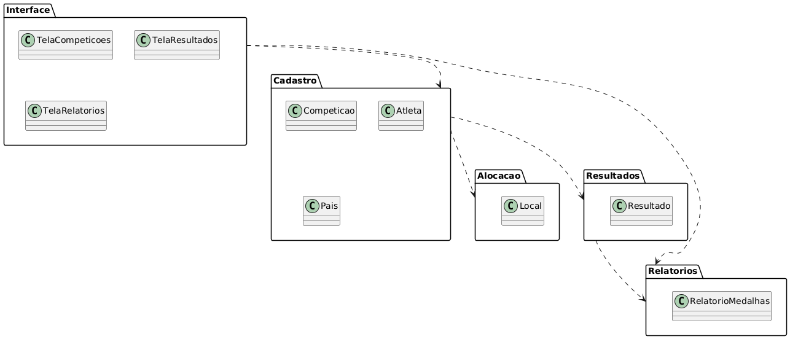
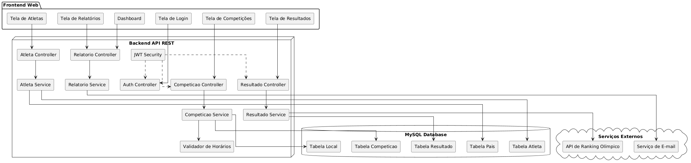
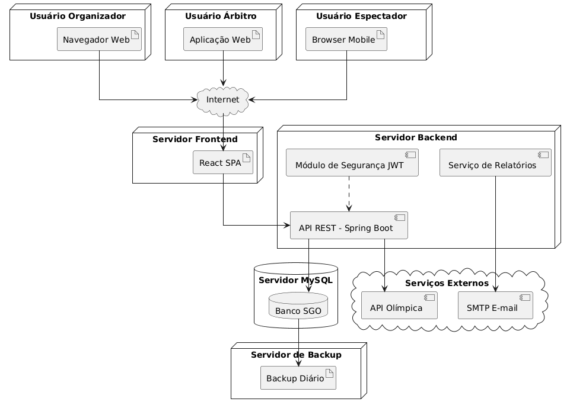

# Sistema de Gestão das Olimpíadas (SGO)

Projeto desenvolvido para a disciplina de Projeto de Software.

## Objetivo

O Sistema de Gestão das Olimpíadas (SGO) tem como objetivo gerenciar:

- Competições olímpicas
- Inscrição de atletas
- Alocação de locais
- Registro de resultados
- Relatórios de medalhas

---

# Histórias de Usuário - Sistema de Gestão das Olimpíadas (SGO)

## US01 - Cadastro de competições

Como organizador,  
quero cadastrar competições,  
para organizar as modalidades olímpicas.

---

## US02 - Editar competições

Como organizador,  
quero editar informações das competições,  
para manter os dados atualizados.

---

## US03 - Excluir competições

Como organizador,  
quero remover competições canceladas,  
para evitar informações incorretas no sistema.

---

## US04 - Inscrição de atletas

Como organizador,  
quero inscrever atletas em competições,  
para controlar os participantes de cada modalidade.

---

## US05 - Associação de atletas aos países

Como organizador,  
quero associar atletas aos seus respectivos países,  
para representar corretamente cada delegação.

---

## US06 - Alocação de locais

Como organizador,  
quero alocar locais para as competições,  
para evitar conflitos de horários entre eventos.

---

## US07 - Consulta de agenda olímpica

Como espectador,  
quero visualizar a agenda das competições,  
para acompanhar os horários e locais dos eventos.

---

## US08 - Registro de resultados

Como árbitro,  
quero registrar os resultados das competições,  
para definir os medalhistas oficiais.

---

## US09 - Geração de relatório de medalhas

Como organizador,  
quero gerar relatórios de medalhas,  
para acompanhar o desempenho dos países.

---

## US10 - Consulta de ranking de países

Como espectador,  
quero consultar o ranking de medalhas dos países,  
para acompanhar a classificação geral das Olimpíadas.

---

# Diagramas UML

## Diagrama de Caso de Uso



---

## Diagrama de Classes



---

## Diagrama de Pacotes



---

## Diagrama de Componentes



---

## Diagrama de Implantação



---

# Estrutura do Repositório

```bash
sgo/
│
├── README.md
│
├── imagens/
│   ├── diagrama-de-caso-de-uso.png
│   ├── diagrama-de-classes.png
│   ├── diagrama-de-pacotes.png
│   ├── diagrama-de-componentes.png
│   └── diagrama-de-implantacao.png
│
└── codigos/
    ├── diagrama-de-caso-de-uso.puml
    ├── diagrama-de-classes.puml
    ├── diagrama-de-pacotes.puml
    ├── diagrama-de-componentes.puml
    └── diagrama-de-implantacao.puml
